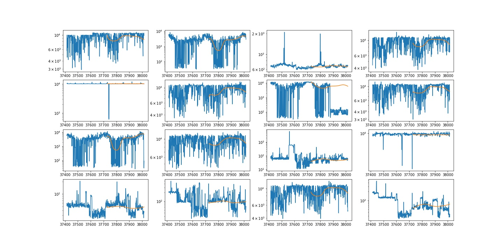
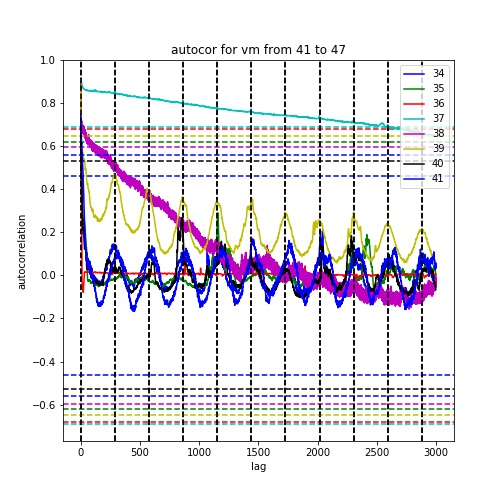

## Bayesian-sequence-to-sequence time series prediction
  
It's tricky to make a prediction on the cloud cpu usage given that the user behaviour varies and the non-additive random noise indicates large uncertainty. The project explores some ad-hoc methods using RNN, seq-to-seq etc. based on Didi cloud data and it may shed an insight to another effort. An incipient attempt to ultilize Bayesian network was also made but given the bayes inference is too time consuming, I give out a simple seq-to-seq network as our first version model with well-refined features which will be explained in next section.

> the bayesian implementation refers to [Fortunato, M., Blundell, C., & Vinyals, O. (2017). Bayesian recurrent neural networks. arXiv preprint arXiv:1704.02798.](https://arxiv.org/pdf/1704.02798.pdf)

### Sanity check
  
This is a simple sanity check on autocorrelation on vm 34 to 41. It indicates strong seaonality as well as slightly decayed power for each vm. The vertical dotted line partition the figure into day scale and we can easily tell the strong autocorrelation given the period of one day.

### Env
1. tensorflow-1.4.1
2. python-3.6 / python3.5
3. pandas
4. numba, argsparse, tqdm etc.

### Data fetch
Main data path: `'/nfs/isolation_project/intern/project/lihaocheng/vm/cpu_max.hdf5'`  
                `'/nfs/isolation_project/intern/project/lihaocheng/vm/vm_cpu_num.hdf5'`  
                `'/nfs/isolation_project/intern/project/lihaocheng/vm/vm_mem_size.hdf5'` -> List[hd]

### Main files
> generate_model.py - main file to do data prepossessing and tarin the model. Dependency: make_features.py, model.py, trainer.py  
> make_features.py - builds features from source data and store in TF tensor  
> input_pipe.py - TF data preprocessing pipeline (assembles features into training/evaluation tensors, performs some sampling and normalisation)  
> model.py - the model  
> trainer.py - trains the model(s)  
> hparams.py - hyperpatameter sets.   
> predict.py - generate predictions and csv for each vm with format 'prediction/true_value' vs. timestamps  

### Execute
Choose a folder to store the weight/tensor/result information. In this demo we create `data`.

Run `python generate_model.py --gpu=-1 --name=s32 --hparam_set=s32 \
--n_model=3 --seasonal=1 --asgd_decay=0.99 \
--predict_window=288 --train_data_path=/nfs/isolation_project/intern/project/lihaocheng/vm \
--logdir=data/logs --datadir=data --seed=5` to do:  
1. extract features:    
    > previous cpu usgae.  
    > 1-day before and 7-day before's cpu usgae.  
    > 1-day before's autocorreclation, 7-day-lag's autocorrelation.   
    > **seasonal**-rank 1-day Fourier periodic features  
    
    It will load from the original hdf5 **train_data_path** (`/nfs/project/xuyixiao/zhangchao.h5`) and extract data and features from the input files and put them into **datadir**`/vars (`data/vars`) as Tensorflow checkpoint. 

2. Train model:  
    Simultaneously train **n_model** models based on different seeds (on a single TF graph). Hyperparameters are described as **s32** from `hparam.py`.  
    Exponential moving average is adjustable with default value **asgd_decay**. Predict window is fixed to **predict_window** fot both training and prediction stages.  
    Log history will be stored in **logdir**. Multiple model generated during the training will be stored in **datadir**`/cpt/s32` (`data/cpt/s32`) and we will pick the best one for prediction.  
  
Run `python predict.py --weight_path=data/cpt/s32 --result_path=data/preds --datadir=data --n_models=3 --predict_window=288 --seed=5` to make a prediction and save the results under `data/preds`

1. Inference:  
    Infer the next **predict_window** cpu usage. Note **n_models** should be consistent with those used in training.  
    Use the model stored in **weight_path** (`data/cpt/s32`) and static features in **datadir**`/vars` (`data/vars`);  
    Save the prediction in **result_path** (`data/preds`)  